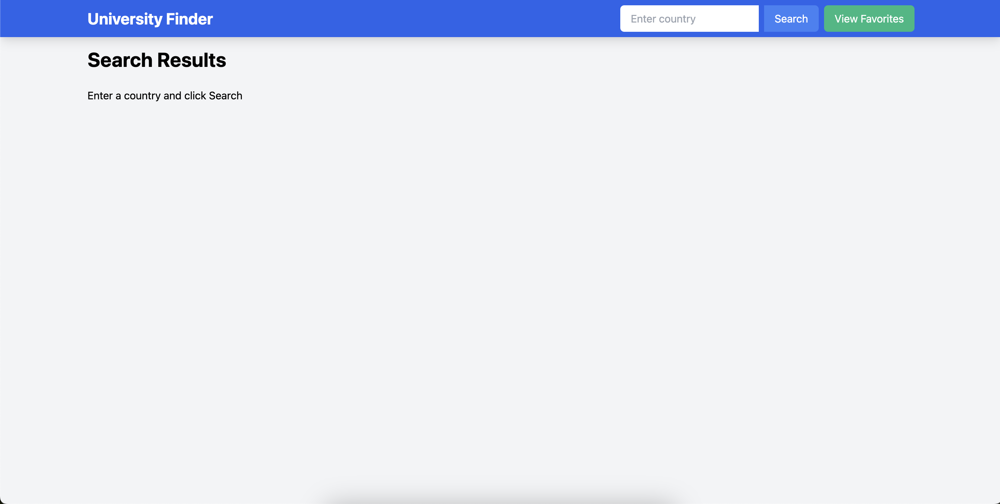
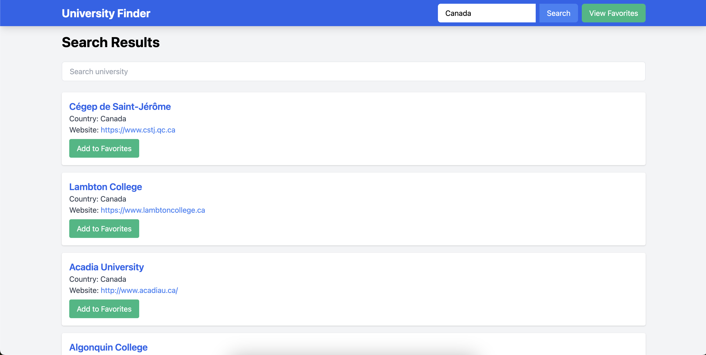

# 🎓 University Finder

Welcome to the University Finder! This web application allows you to search for universities by country, view university details, and save your favorite universities for easy reference later.

## 🌟 Features

- 🌍 **Search by Country**: Enter a country to get a list of universities.
- 🔍 **University Search**: Filter universities within the search results.
- 💾 **Save Favorites**: Save your favorite universities and view them later.
- 📍 **Map Integration**: View the location of universities on a map.
- 📜 **Scrollable Modals**: Easily scroll through long lists of favorites.

## 🛠️ Technologies Used

- HTML
- CSS (Tailwind)
- JavaScript (jQuery)
- API: [Hipolabs University API](http://universities.hipolabs.com/)

## 🚀 Getting Started

### Prerequisites

- A web browser
- Internet connection

### Installation

1. Clone the repository:
   ```bash
   git clone https://github.com/your-username/university-finder.git

2. Navigate to the project directory:
   ```bash
   cd university-finder

3. Open index.html in your web browser:
   ```bash
   open index.html
## 🧑‍💻 Usage

1. Enter a country in the search bar and click "Search".
2. View the list of universities in the selected country.
3. Filter universities using the search box that appears after searching for a country.
4. Add universities to your favorites by clicking the "Add to Favorites" button.
5. View your favorite universities by clicking the "View Favorites" button.

## 🌐 Live Demo
Check out the live demo of the [University Finder](https://tailwindcss.com/)

## 📷 Screenshots
### Main Search Interface


### Search Results


### Favorites Modal


## 🙏 Acknowledgements
- Thanks to [Hipolabs](https://hipolabs.com/) for their [University API](http://universities.hipolabs.com/).
- Thanks to [Tailwind](https://tailwindcss.com/) for providing a utility-first CSS framework.
## 📞 Contact
If you have any questions or feedback, feel free to reach out!

- GitHub: [mltpascual](https://github.com/mltpascual)
- Email: miguelpascual.life@gmail.com
- LinkedIn: [LinkedIn](https://www.linkedin.com/in/mltpascual/)

   
